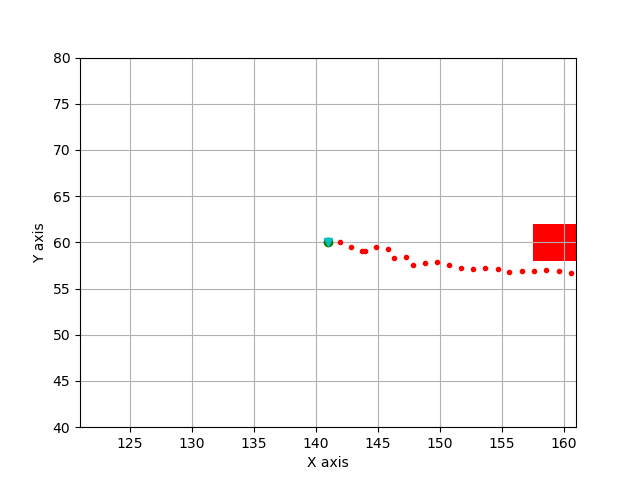

# RRT*

<!--  -->


## Overview

This repository contains a fast, C++ implementation of the RRT* algorithm
with a Python wrapper. It is used as one of the motion planning models in
[pylot](https://github.com/erdos-project/pylot), an [erdos](https://github.com/erdos-project) project.

The base RRT code is inspired by [sourishg/rrt-simulator](https://github.com/sourishg/rrt-simulator), which implements RRT.

Reference Paper:
[Sampling-based Algorithms for Optimal Motion Planning](https://arxiv.org/pdf/1105.1186.pdf)

## Profiling

Some basic profiling of the code (80 meter x 10 meter search space, 10 obstacles) indicates the following expected performance:

```
Average Time (success): ~6 ms
Max Time (success): ~60 ms
Failure Case (Running all 2000 iterations): <250 ms
```

## Setup

```
git clone https://github.com/erdos-project/rrt-star-planning.git
./build.sh
```

## Example Usage

There is a Python wrapper and C++ API. The Python wrapper is located in
`RRTStar/rrtstar_wrapper.py` and the C++ API is under
`src/RRTStar/RRTStarWrapper.cpp`.
The following command will simulate a simple scenario to run the RRT* planning
algorithm.

```
python3 RRTStar/rrtstar.py
```
